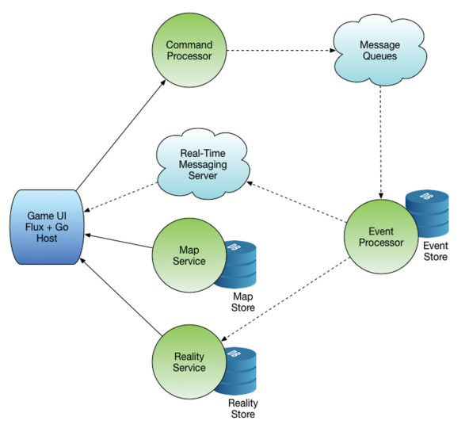

# CloudNativeGo
World of FluxCraft 例子学习和整理　https://github.com/cloudnativego 

#### 架构

+ 进入游戏，在游戏界面(**Game GUI**)上移动或者与其他游戏玩家交互时，移动操作会被发生到命令处理器(**Command Processor**)，命令被转换成事件被发送到消息队列系统(**Message Queues**)。
+ 事件处理器(**Event Processor**)的任务就是处理事件，然后事件会被持久化到历史档案中。经过处理的游戏状态被发生到高速缓存(**Reality Service**)和实时消息基础组件(**Real-Time Messageing Server**)。
+ 每场游戏可以使用不同的地图，所以可以检索地图服务。

+ 架构的特点：
  + 每一个圆圈是一个微服务。
  + 每个微服务都是无状态的。
  + 数据流是单项不可变的。

#### 子项目

+ [Flux GUI](https://github.com/cloudnativego/wof-ui)

  + Go Host ：不允许前端(Javastript直接和命令服务器交互)，避免不需要的问题，所以使用Go Host。当服务更加复杂的时候我们会引入网关。

+ [Command Processor](https://github.com/cloudnativego/wof-commandprocessing)

+ Message Queue

  这边使用的是RabbitMQ

+ [Event Processor](https://github.com/cloudnativego/wof-eventprocessing)

+ [Reality Service](https://github.com/cloudnativego/wof-reality)

+ [Map  Service](https://github.com/cloudnativego/wof-mapservice)

+ [wof-cf-acceptance](https://github.com/cloudnativego/wof-cf-acceptance)

